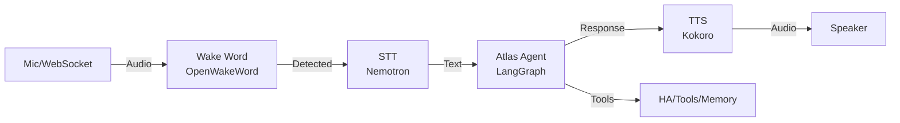

# Atlas Autonomous Opportunities 🏗️

This document analyzes the **Atlas** distributed assistant system and identifies where autonomous agency features can be added, based on patterns from OpenClaw.

<Note>
**Context**: Atlas is a Python-based, fully local, distributed assistant system focused on voice-to-voice interaction, Home Assistant integration, and multi-modal workflows. It uses local models (Qwen3, Nemotron) and is hardware-constrained (16-24GB VRAM).
</Note>

## Atlas Current Architecture

### System Overview

**Repository**: https://github.com/canfieldjuan/atlas

**Stack**: 
- Language: **Python** (100% - not TypeScript like OpenClaw)
- LLM: Local models via Ollama (Qwen3 8B/14B/30B)
- STT: Nemotron (local)
- TTS: Kokoro (local) 
- Orchestration: LangGraph for workflow state machines
- Storage: PostgreSQL + JSONB for session metadata
- Architecture: Distributed with modular "modes"

**Core Components**:

```
atlas/
├── atlas_brain/          # Main orchestration layer
│   ├── agents/          # Agent graphs (Atlas, booking, reminder, email)
│   ├── orchestration/   # Voice loop and context management
│   ├── services/        # STT, TTS, LLM, reminders, tools
│   ├── storage/         # Database models and repositories
│   ├── jobs/            # Background jobs (nightly_memory_sync)
│   └── api/             # FastAPI endpoints
├── atlas_comms/         # External communications (email, SMS, ntfy)
├── atlas_edge/          # Edge device integration
└── atlas_video-processing/  # Vision and camera processing
```

### Voice Pipeline (P0 - Already Working)



**Key Files**:
- Pipeline: `atlas_brain/orchestration/__init__.py:run_voice_loop()`
- Agent: `atlas_brain/agents/graphs/atlas.py:AtlasAgent`
- Tools: `atlas_brain/tools/` (calendar, reminder, etc.)

### Multi-Turn Workflows (Phase 5 Complete)

Atlas has **working multi-turn slot-filling** for:
- **Booking**: "Schedule an appointment" → asks for name → date → phone → confirms
- **Reminder**: "Remind me" → asks for time → message → creates reminder
- **Email**: "Send an email" → asks for recipient → subject → body → sends
- **Calendar**: "Check my calendar" → can add events, check availability

**Architecture**: Uses `session.metadata.active_workflow` in PostgreSQL to persist workflow state between turns.

**Key Insight**: Voice turns are already continuous. The gap Atlas solved was **persisting workflow state** between agent turns.

## Where Autonomous Agency Can Be Added

### 1. Cron/Scheduled Jobs ⭐ HIGH PRIORITY

**Current State**: 
- ✅ Has background job system: `atlas_brain/jobs/nightly_memory_sync.py`
- ❌ Only one job exists (memory sync at 2 AM)
- ❌ No user-facing scheduled reminders/tasks
- ❌ No flexible cron-like scheduler

**Opportunity**: **Add OpenClaw-style cron system**

**What Works Locally**:
- Infrastructure already exists (background job pattern)
- Reminder service is operational (`atlas_brain/services/reminders.py`)
- Notification delivery via ntfy works
- Local Qwen3 30B can handle simple scheduled tasks

**Implementation Path**:

```python
# atlas_brain/jobs/scheduler.py (NEW)
from apscheduler.schedulers.asyncio import AsyncIOScheduler
from atlas_brain.storage.repositories.scheduled_task import ScheduledTaskRepository

class TaskScheduler:
    """OpenClaw-inspired cron system for Atlas."""
    
    def __init__(self):
        self.scheduler = AsyncIOScheduler()
        self.task_repo = ScheduledTaskRepository()
    
    async def add_task(
        self,
        name: str,
        schedule: str,  # cron expression or ISO timestamp
        task_type: str,  # "reminder", "email_summary", "device_check"
        payload: dict,
        agent_id: str = "main"
    ):
        """Add a scheduled task."""
        # Store in DB
        task = await self.task_repo.create({
            "name": name,
            "schedule": schedule,
            "task_type": task_type,
            "payload": payload,
            "agent_id": agent_id,
            "enabled": True
        })
        
        # Register with APScheduler
        if is_cron(schedule):
            self.scheduler.add_job(
                self._execute_task,
                "cron",
                args=[task.id],
                **parse_cron(schedule)
            )
        else:
            self.scheduler.add_job(
                self._execute_task,
                "date",
                run_date=parse_iso(schedule),
                args=[task.id]
            )
    
    async def _execute_task(self, task_id: int):
        """Execute a scheduled task."""
        task = await self.task_repo.get(task_id)
        
        if task.task_type == "reminder":
            # Trigger reminder workflow
            from atlas_brain.agents.graphs.reminder import run_reminder_workflow
            await run_reminder_workflow(task.payload["message"])
        
        elif task.task_type == "email_summary":
            # Run agent with email summarization prompt
            from atlas_brain.agents.graphs.atlas import run_atlas_agent
            result = await run_atlas_agent(
                user_input="Summarize my unread emails from the last 12 hours",
                session_id=f"cron:{task.id}"
            )
            # Deliver via ntfy
            from atlas_brain.alerts import get_alert_manager
            await get_alert_manager().send_alert("Email Summary", result["response"])
        
        elif task.task_type == "device_check":
            # Check Home Assistant devices
            # ...
```

**Use Cases**:
- ✅ **Morning briefings**: "Every day at 7 AM, summarize my calendar and emails"
- ✅ **Device automation**: "Every evening at sunset, check if all doors are locked"
- ✅ **Recurring reminders**: "Every Monday, remind me to take out trash"
- ✅ **Health checks**: "Every 15 minutes, verify cameras are online"

**Model Requirements**: Qwen3 30B perfect for this - simple template-based tasks.

### 2. Email Hook System ⭐ HIGH PRIORITY

**Current State**:
- ✅ Email sending works (`atlas_comms/email/`)
- ✅ Email workflow exists (`atlas_brain/agents/graphs/email.py`)
- ❌ No email **monitoring** or webhook integration
- ❌ No autonomous email responses

**Opportunity**: **Add email monitoring + auto-categorization**

**What Works Locally**:
- Gmail API integration already exists
- Email parsing/sending infrastructure ready
- Qwen3 30B excellent at email categorization
- Notification system (ntfy) can alert on important emails

**Implementation Path**:

```python
# atlas_brain/jobs/email_monitor.py (NEW)
import imaplib
from atlas_brain.config import settings
from atlas_brain.agents.graphs.atlas import run_atlas_agent

class EmailMonitor:
    """Monitor email inbox and auto-categorize/respond."""
    
    async def check_inbox(self):
        """Check for new emails via IMAP."""
        mail = imaplib.IMAP4_SSL(settings.email.imap_host)
        mail.login(settings.email.address, settings.email.password)
        mail.select("INBOX")
        
        # Get unread emails
        status, messages = mail.search(None, "UNSEEN")
        
        for msg_id in messages[0].split():
            email_data = self._fetch_email(mail, msg_id)
            
            # Categorize with local LLM
            category = await self._categorize_email(email_data)
            
            if category == "urgent":
                # Notify immediately
                await self._notify_urgent(email_data)
            elif category == "spam":
                # Auto-archive
                await self._archive_email(mail, msg_id)
            elif category == "receipt":
                # Extract and log
                await self._process_receipt(email_data)
    
    async def _categorize_email(self, email_data: dict) -> str:
        """Use local Qwen3 to categorize email."""
        prompt = f"""Categorize this email as one of: urgent, info, spam, receipt, personal

From: {email_data['from']}
Subject: {email_data['subject']}
Body: {email_data['body'][:500]}

Reply with just the category word."""
        
        result = await run_atlas_agent(
            user_input=prompt,
            session_id="email_monitor",
            model="qwen3:30b",
            thinking_disabled=True  # Fast classification
        )
        
        return result["response"].strip().lower()
```

**Use Cases**:
- ✅ **Email triage**: Auto-categorize emails (urgent/info/spam)
- ✅ **Smart notifications**: Alert only on important emails
- ✅ **Auto-archive**: Move spam/receipts automatically
- ✅ **Summary digests**: "Here are your 5 most important emails today"

**Model Requirements**: Qwen3 30B perfect - single-pass classification.

### 3. Event-Driven Hooks ⭐ MEDIUM PRIORITY

**Current State**:
- ✅ Alert system exists (`atlas_brain/alerts/`)
- ✅ Event delivery via ntfy works
- ❌ No hook system for lifecycle events
- ❌ No "on session start/end" automation

**Opportunity**: **Add OpenClaw-style hooks**

**What Works Locally**:
- Alert manager can dispatch events
- Simple scripts can react to events
- No complex reasoning needed

**Implementation Path**:

```python
# atlas_brain/hooks/manager.py (NEW)
from typing import Callable, Dict, List
from enum import Enum

class HookEvent(Enum):
    SESSION_START = "session_start"
    SESSION_END = "session_end"
    COMMAND_NEW = "command_new"
    WORKFLOW_COMPLETE = "workflow_complete"
    DEVICE_STATE_CHANGE = "device_state_change"

class HookManager:
    """OpenClaw-inspired event hook system."""
    
    def __init__(self):
        self._hooks: Dict[HookEvent, List[Callable]] = {}
    
    def register(self, event: HookEvent, callback: Callable):
        """Register a hook callback."""
        if event not in self._hooks:
            self._hooks[event] = []
        self._hooks[event].append(callback)
    
    async def trigger(self, event: HookEvent, context: dict):
        """Trigger all hooks for an event."""
        if event not in self._hooks:
            return
        
        for callback in self._hooks[event]:
            try:
                await callback(context)
            except Exception as e:
                print(f"Hook error: {e}")

# Example hooks
async def on_session_start(context: dict):
    """Log session start to memory."""
    from atlas_brain.storage.repositories.session import SessionRepository
    session_repo = SessionRepository()
    await session_repo.add_note(
        context["session_id"],
        f"Session started at {context['timestamp']}"
    )

async def on_workflow_complete(context: dict):
    """Save completed workflow to memory."""
    if context["workflow_type"] == "booking":
        # Log successful booking
        from atlas_brain.memory import add_memory
        await add_memory(
            f"Booked appointment: {context['result']}"
        )
```

**Use Cases**:
- ✅ **Session logging**: Auto-log all interactions for review
- ✅ **Memory snapshots**: Save conversation context when session ends
- ✅ **Workflow completion**: Trigger follow-up actions after booking/reminder
- ✅ **Device change alerts**: Alert when smart lock opens unexpectedly

**Model Requirements**: **No LLM needed** - pure infrastructure.

### 4. Presence-Based Automation ⭐ MEDIUM PRIORITY

**Current State**:
- ✅ Has presence detection system (`atlas_brain/presence/`)
- ✅ Can detect people via cameras
- ❌ No automation triggered by presence
- ❌ No "when person arrives, do X"

**Opportunity**: **Add presence-triggered actions**

**What Works Locally**:
- Person detection works (vision system)
- Device control works (Home Assistant)
- Just needs the glue layer

**Implementation Path**:

```python
# atlas_brain/presence/automation.py (NEW)
from atlas_brain.presence import get_presence_manager
from atlas_brain.capabilities.backends.homeassistant import HomeAssistantBackend

class PresenceAutomation:
    """Trigger actions based on presence changes."""
    
    def __init__(self):
        self.presence = get_presence_manager()
        self.ha = HomeAssistantBackend()
        self.rules = []
    
    async def add_rule(
        self,
        person_id: str,
        zone: str,  # "home", "office", "away"
        action: str,  # "arrive", "leave"
        automation: dict
    ):
        """Add a presence-triggered rule."""
        rule = {
            "person_id": person_id,
            "zone": zone,
            "action": action,
            "automation": automation
        }
        self.rules.append(rule)
    
    async def on_presence_change(self, event: dict):
        """React to presence changes."""
        for rule in self.rules:
            if (event["person_id"] == rule["person_id"] and
                event["zone"] == rule["zone"] and
                event["action"] == rule["action"]):
                
                await self._execute_automation(rule["automation"])
    
    async def _execute_automation(self, automation: dict):
        """Execute the automation."""
        if automation["type"] == "device_control":
            # Turn on lights when arriving home
            await self.ha.turn_on(automation["entity_id"])
        
        elif automation["type"] == "notification":
            # Send alert
            from atlas_brain.alerts import get_alert_manager
            await get_alert_manager().send_alert(
                automation["title"],
                automation["message"]
            )
        
        elif automation["type"] == "workflow":
            # Trigger agent workflow
            from atlas_brain.agents.graphs.atlas import run_atlas_agent
            await run_atlas_agent(
                user_input=automation["prompt"],
                session_id="presence_automation"
            )
```

**Use Cases**:
- ✅ **Welcome home**: "When I arrive, turn on lights and read calendar"
- ✅ **Security**: "When unknown person detected, send alert"
- ✅ **Energy saving**: "When everyone leaves, turn off all devices"
- ✅ **Context switching**: "When I enter office, switch to business mode"

**Model Requirements**: **No LLM needed** for triggers. Optional LLM for actions.

### 5. Memory-Triggered Actions ⭐ LOW PRIORITY

**Current State**:
- ✅ Has nightly memory sync (`atlas_brain/jobs/nightly_memory_sync.py`)
- ✅ Has memory storage system
- ❌ No memory-based triggers
- ❌ No "when I learn X, do Y"

**Opportunity**: **Add memory-aware automation**

**Implementation Path**:

```python
# atlas_brain/memory/triggers.py (NEW)
class MemoryTrigger:
    """Trigger actions based on memory updates."""
    
    async def on_memory_update(self, memory_entry: dict):
        """Check if memory triggers any actions."""
        
        # Example: If memory contains "birthday", set reminder
        if "birthday" in memory_entry["content"].lower():
            date = extract_date(memory_entry["content"])
            await self._create_birthday_reminder(date)
        
        # Example: If memory contains "important", notify
        if memory_entry["importance"] == "high":
            await self._notify_important_memory(memory_entry)
```

**Use Cases**:
- ⚠️ **Proactive reminders**: "Learned someone's birthday → auto-create reminder"
- ⚠️ **Follow-up actions**: "Learned about pending task → check status tomorrow"
- ⚠️ **Context building**: "Learned preference → update user profile"

**Model Requirements**: Qwen3 30B for extraction. May hallucinate.

## Comparison: OpenClaw vs Atlas

| Feature | OpenClaw | Atlas | Portable? |
|---------|----------|-------|-----------|
| **Language** | TypeScript/Node.js | Python | ❌ No - must reimplement |
| **Cron Jobs** | ✅ Full system | ❌ Only nightly sync | ✅ **Can add** |
| **Email Hooks** | ✅ Gmail Pub/Sub | ❌ Manual only | ✅ **Can add** |
| **Event Hooks** | ✅ Hook system | ❌ Alert system only | ✅ **Can add** |
| **Multi-turn** | ⚠️ Via queue | ✅ Native (LangGraph) | N/A - Atlas better |
| **Tool Calling** | ✅ Native | ✅ Native | N/A - Both have |
| **Local Models** | ⚠️ Via Ollama | ✅ Primary | N/A - Atlas better |
| **Distributed** | ❌ Single gateway | ✅ Multi-node | N/A - Atlas better |

**Key Insight**: OpenClaw's **patterns** are portable, but not the code. Atlas needs Python implementations of cron/hooks/email monitoring.

## Recommended Implementation Order

### Phase 1: Core Autonomy (High Value, Low Complexity)

1. **Cron/Scheduler System** ⭐⭐⭐
   - Priority: P0
   - Complexity: Low (APScheduler integration)
   - Model: Qwen3 30B perfect
   - Timeline: 1-2 days
   - Value: Enables all scheduled autonomous tasks

2. **Email Monitor + Categorization** ⭐⭐⭐
   - Priority: P0
   - Complexity: Medium (IMAP + LLM categorization)
   - Model: Qwen3 30B perfect
   - Timeline: 2-3 days
   - Value: Auto-triage emails, reduce inbox noise

### Phase 2: Event-Driven Autonomy (Medium Value, Low Complexity)

3. **Hook System** ⭐⭐
   - Priority: P1
   - Complexity: Low (event dispatcher)
   - Model: Not needed (infrastructure)
   - Timeline: 1 day
   - Value: Enables lifecycle automation

4. **Presence Automation** ⭐⭐
   - Priority: P1
   - Complexity: Low (already has presence detection)
   - Model: Optional (for action execution)
   - Timeline: 1-2 days
   - Value: Context-aware smart home

### Phase 3: Advanced Autonomy (Lower Value, Higher Complexity)

5. **Memory Triggers** ⭐
   - Priority: P2
   - Complexity: High (risk of hallucination)
   - Model: Qwen3 30B, may need larger
   - Timeline: 3-4 days
   - Value: Proactive assistance

## Architecture Recommendations

### Add Autonomous Components Directory

```
atlas_brain/
├── autonomous/          # NEW - Autonomous systems
│   ├── __init__.py
│   ├── scheduler.py     # Cron-like task scheduler
│   ├── email_monitor.py # Email monitoring + categorization
│   ├── hooks.py         # Event hook system
│   └── presence_triggers.py  # Presence-based automation
├── agents/              # Existing
├── jobs/                # Existing background jobs
└── ...
```

### Shared Infrastructure

**Already exists in Atlas**:
- ✅ PostgreSQL for state persistence
- ✅ ntfy for notifications
- ✅ Alert manager for event delivery
- ✅ Session metadata (JSONB) for workflow state
- ✅ Background job pattern

**Need to add**:
- ❌ Task scheduler (APScheduler)
- ❌ Email IMAP monitoring
- ❌ Hook event dispatcher
- ❌ Rule engine for triggers

### Configuration

```python
# atlas_brain/config.py - ADD
class AutonomousSettings:
    # Scheduler
    scheduler_enabled: bool = True
    scheduler_timezone: str = "America/New_York"
    
    # Email monitoring
    email_monitor_enabled: bool = False
    email_check_interval: int = 300  # 5 minutes
    email_imap_host: str = "imap.gmail.com"
    
    # Hooks
    hooks_enabled: bool = True
    hooks_on_session_start: List[str] = []
    hooks_on_session_end: List[str] = ["save_memory"]
    
    # Presence
    presence_automation_enabled: bool = True
```

## Model Requirements for Autonomous Tasks

### Qwen3 30B Perfect For ✅

- Email categorization (urgent/spam/info)
- Calendar summarization
- Reminder extraction from text
- Device status checking
- Log parsing and alerting
- Template-based reports

### Qwen3 30B Adequate For ⚠️

- Multi-step device automation (2-3 steps)
- Simple email responses
- Basic workflow triggering
- Data extraction from structured sources

### Need Larger Model For ❌

- Complex email composition
- Multi-step reasoning chains (4+ steps)
- Code generation
- Creative content
- Nuanced decision-making

## Security Considerations

### Atlas Already Has

- ✅ Local-only execution (no cloud)
- ✅ No external API calls for LLM
- ✅ Database-backed state (not ephemeral)

### Need to Add

- ❌ Rate limiting for autonomous actions
- ❌ Approval gates for high-risk operations
- ❌ Audit logging for automated decisions
- ❌ Failsafe mode (disable automation on error)

## Summary: Atlas Autonomous Agency Roadmap

### Can Add Immediately with Qwen3 30B

1. ✅ **Cron scheduler** - Schedule tasks, reminders, reports
2. ✅ **Email monitoring** - Auto-categorize, alert on important
3. ✅ **Event hooks** - Lifecycle automation (session start/end)
4. ✅ **Presence triggers** - Location-based automation

### Already Works Better Than OpenClaw

1. ✅ **Multi-turn workflows** - Native LangGraph state persistence
2. ✅ **Local-first** - All inference local (Qwen3, Nemotron, Kokoro)
3. ✅ **Distributed** - Multi-node architecture
4. ✅ **Python ecosystem** - Rich libraries (APScheduler, SQLAlchemy, etc.)

### Not Portable from OpenClaw

- ❌ TypeScript code (must rewrite in Python)
- ❌ Node.js-specific patterns
- ✅ **BUT** architectural patterns ARE portable

### Key Takeaway

**Atlas is well-positioned for autonomous features**:
- Python makes implementation easier than TypeScript
- Local models (Qwen3 30B) already integrated
- Background job infrastructure exists
- Multi-turn workflow state already solved
- Just needs the autonomous **orchestration layer**

**Recommendation**: Start with **Phase 1** (cron + email monitor). These provide immediate value and unlock autonomous operation.

## Next Steps

1. **Create autonomous module**: `atlas_brain/autonomous/`
2. **Implement scheduler**: Based on APScheduler
3. **Add email monitor**: IMAP + Qwen3 categorization
4. **Test with real workflows**: Morning briefing, email triage, device checks
5. **Document patterns**: Create Atlas-specific autonomous guide

---

**Related Documentation**:
- [Local Autonomous Setup](/concepts/local-autonomous-setup) - OpenClaw patterns
- [How Agents Work](/concepts/how-agents-work) - Agent architecture

**Atlas Repository**: https://github.com/canfieldjuan/atlas
