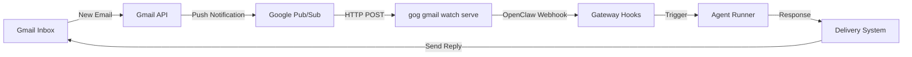
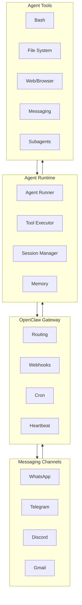

# How Agents Work 🤖

OpenClaw agents are AI-powered assistants that can autonomously respond to messages, execute tasks, and make decisions. This guide explains how they work, how they respond to emails, and what level of autonomy they have.

<Note>
**Cloud vs Local Models**: OpenClaw uses **cloud APIs** (Anthropic, OpenAI, etc.) by default for best results. Local models are supported but may have reduced reliability for complex autonomous tasks. See [Cloud vs Local Models](#cloud-vs-local-models) for details.
</Note>

## What Are Agents?

An **agent** in OpenClaw is an AI assistant with:

- **Identity**: Each agent has a unique ID, name, avatar, and personality (defined in `SOUL.md`)
- **Workspace**: A dedicated directory where the agent can read/write files and execute commands
- **Model**: A specific AI model (Claude, GPT, etc.) that powers the agent's reasoning _(see [Cloud vs Local Models](#cloud-vs-local-models) below)_
- **Tools**: Access to bash execution, file operations, messaging, browser automation, and more
- **Memory**: Session transcripts and workspace files that provide context across conversations
- **Skills**: Specialized capabilities that can be loaded on-demand (similar to VS Code extensions)

### Agent Configuration

Agents are configured in `~/.openclaw/openclaw.json`:

```json5
{
  agents: {
    defaults: {
      workspace: "~/.openclaw/workspace",
      model: "anthropic/claude-sonnet-4-20250514",
      sandbox: {
        enabled: true,
        workspaceRoot: "~/.openclaw/sandboxes"
      }
    }
  }
}
```

**Key files**: `src/agents/`, `src/config/types.agents.ts`

## Cloud vs Local Models

### Default: Cloud APIs ☁️

**OpenClaw uses cloud-based AI APIs by default:**

- **Anthropic** (Claude Pro/Max) - Recommended for best results
- **OpenAI** (ChatGPT/Codex) - GPT-5.2, GPT-4o, o1, etc.
- **OpenRouter** - Access to multiple providers
- Other cloud providers: Moonshot, Minimax, GLM, etc.

These are **hosted services** that require:
- Internet connection
- API keys or OAuth tokens
- Subscription (for Claude Pro/Max, ChatGPT Plus/Pro)

**Why cloud APIs are recommended:**
- **Long context windows**: Claude 200K, GPT-4o 128K for handling large codebases
- **Tool use reliability**: Better at structured tool calling and multi-step reasoning
- **Prompt injection resistance**: More robust safety training
- **Performance**: Fast inference with high-quality responses

### Local Models Support 🏠

OpenClaw **can** work with local models via:
- **OpenAI-compatible endpoints** (Ollama, LM Studio, vLLM, etc.)
- **Custom providers** configured to point to `localhost`

**Example local model config:**

```json5
{
  agents: {
    defaults: {
      model: "openai/local-model",
      provider: {
        openai: {
          baseURL: "http://localhost:11434/v1",  // Ollama
          apiKey: "ollama"  // Dummy key
        }
      }
    }
  }
}
```

### Differences with Local Models

| Feature | Cloud APIs | Local Models |
|---------|-----------|--------------|
| **Context Window** | 128K-200K tokens | Typically 4K-32K |
| **Tool Calling** | Excellent structured output | May be unreliable |
| **Response Quality** | High consistency | Varies by model |
| **Autonomy Features** | ✅ All work well | ⚠️ May be limited |
| **Speed** | Fast (optimized infra) | Depends on hardware |
| **Privacy** | Data sent to provider | Fully private |
| **Cost** | Subscription required | Free after hardware |
| **Internet Required** | Yes | No |

**Autonomy with local models:**

✅ **These still work:**
- Message responses (agents respond to any message)
- Cron jobs (scheduled tasks execute)
- Hooks (event-driven automation triggers)
- Tool execution (bash, files, etc.)

⚠️ **These may be degraded:**
- **Email responses**: Local models may struggle with complex email parsing and deciding when/how to respond
- **Multi-step reasoning**: Shorter context windows make it harder to maintain state across multiple tool calls
- **Tool use reliability**: Local models may produce malformed JSON or skip tool calls
- **Decision quality**: May make less optimal choices about which tools to use

**Real-world example:**

A **cloud model** (Claude Sonnet) might:
1. Read an email about a bug report
2. Search the codebase for related code
3. Identify the likely cause
4. Draft a detailed response with diagnosis
5. Schedule a follow-up task to verify the fix

A **local model** (Llama 3.2 8B) might:
1. Read the email ✅
2. Attempt to search but produce malformed tool call ❌
3. Generate a generic response without context ⚠️

### Recommendation

**For production use**: Stick with cloud APIs (Anthropic Claude or OpenAI GPT) for reliable autonomous operation.

**For experimentation**: Local models work for basic chat and simple tasks, but expect reduced quality for complex autonomy.

**Docs**: [Model Providers](/concepts/model-providers), [Model Configuration](/concepts/models)

## How Agents Respond to Emails

### Gmail Integration Architecture

Agents can automatically respond to emails through the **Gmail Pub/Sub + Webhook** system:



### Step-by-Step Email Response Flow

1. **Gmail Watch**: Gmail monitors your inbox labels (e.g., `INBOX`) and publishes change notifications to Google Cloud Pub/Sub
2. **Push Handler**: The `gog gmail watch serve` daemon receives Pub/Sub push notifications at `http://localhost:8788/gmail-pubsub`
3. **Webhook Trigger**: The daemon forwards email metadata (from, subject, body snippet) to the OpenClaw Gateway webhook at `/hooks/gmail`
4. **Agent Activation**: The hook system creates an **isolated agent session** (`hook:gmail:{{messageId}}`) with the email content as the initial message
5. **Agent Processing**: The agent reads the email, analyzes it, and decides how to respond using its tools and context
6. **Response Delivery**: The agent's response is delivered back to the configured channel (WhatsApp, Telegram, etc.) or can be sent as an email reply

### Configuration Example

Enable Gmail hooks in `~/.openclaw/openclaw.json`:

```json5
{
  hooks: {
    enabled: true,
    token: "OPENCLAW_HOOK_TOKEN",
    presets: ["gmail"],
    mappings: [
      {
        match: { path: "gmail" },
        action: "agent",
        wakeMode: "now",
        name: "Gmail",
        sessionKey: "hook:gmail:{{messages[0].id}}",
        messageTemplate: "New email from {{messages[0].from}}\nSubject: {{messages[0].subject}}\n{{messages[0].snippet}}\n{{messages[0].body}}",
        model: "openai/gpt-5.2-mini",
        deliver: true,
        channel: "last"
      }
    ]
  }
}
```

**Setup wizard**: `openclaw webhooks gmail setup --account your@gmail.com`

**Docs**: [Gmail Pub/Sub](/automation/gmail-pubsub), [Webhooks](/automation/webhook)

## Is It Autonomous? Yes! ✅

OpenClaw agents operate autonomously through several mechanisms:

### 1. Automatic Message Responses

When someone sends a message via WhatsApp, Telegram, Discord, or any connected channel, the agent automatically:

- Receives the message via the Gateway
- Loads session context and memory
- Processes the message using its AI model
- Executes any necessary tools (bash, file operations, web searches)
- Generates and sends a response back to the sender

**No human intervention required** once the Gateway is running.

### 2. Scheduled Tasks (Cron Jobs)

Agents can run tasks on a schedule using the built-in cron system:

```bash
# Run every morning at 7 AM
openclaw cron add \
  --name "Morning brief" \
  --cron "0 7 * * *" \
  --tz "America/Los_Angeles" \
  --session isolated \
  --message "Summarize overnight updates and check my calendar." \
  --announce \
  --channel whatsapp \
  --to "+15551234567"
```

**Supported schedules**:
- One-shot: `--at "2026-02-01T16:00:00Z"`
- Recurring: `--cron "0 7 * * *"` (5-field cron expression)
- Interval: `--every "1h"` (every hour)

**Docs**: [Cron Jobs](/automation/cron-jobs)

### 3. Event-Driven Hooks

Hooks trigger agents in response to system events:

```typescript
// Example: Save session context when /new command is issued
const handler: HookHandler = async (event) => {
  if (event.type === "command" && event.action === "new") {
    // Save last 15 lines of conversation to memory
    await saveSessionToMemory(event.context.sessionEntry);
    event.messages.push("✅ Session saved to memory");
  }
};
```

**Built-in hooks**:
- **session-memory**: Auto-save sessions to `workspace/memory/` on `/new`
- **command-logger**: Log all commands to `~/.openclaw/logs/commands.log`
- **boot-md**: Run `BOOT.md` instructions on Gateway startup
- **soul-evil**: Swap personality files at scheduled times

**Docs**: [Hooks](/automation/hooks)

### 4. Heartbeat Polling

For context-aware monitoring, agents use the **heartbeat system** to periodically check for updates:

```json5
{
  gateway: {
    heartbeat: {
      enabled: true,
      interval: 300000  // 5 minutes in milliseconds
    }
  }
}
```

The agent runs a lightweight check every N minutes and can:
- Review queued system events
- Check for external changes (calendar, inbox, etc.)
- Decide if action is needed based on current context

**Docs**: [Cron vs Heartbeat](/automation/cron-vs-heartbeat)

### 5. OAuth Token Management

Agents automatically refresh OAuth tokens to maintain long-running access:

- Claude Pro/Max tokens (Anthropic)
- ChatGPT/Codex tokens (OpenAI)
- Gmail API tokens

**No manual re-authentication required** after initial setup.

**Docs**: [OAuth](/concepts/oauth)

## Do Agents Have Agency? Yes! 🧠

OpenClaw agents have significant decision-making capabilities:

### Tool Execution

Agents can execute powerful tools with **approval gates** for safety:

```typescript
// Available tools (from src/agents/pi-tools.ts):
- bash: Execute shell commands
- view: Read files
- edit: Modify files  
- create: Create new files
- grep/glob: Search code
- web_fetch: Fetch web pages
- browser: Automate web browsers
- message: Send messages to any connected channel
- session: Spawn sub-agents
- task: Delegate work to specialized agents
```

**Example decision flow**:

1. User asks: "Deploy the latest changes to production"
2. Agent decides:
   - Run tests first (`bash: npm test`)
   - Check git status (`bash: git status`)
   - If clean, deploy (`bash: ./deploy.sh`)
   - Send confirmation message (`message: "Deployed v1.2.3"`)

### Subagent Spawning

Agents can spawn other agents to handle specialized tasks:

```json
// Agent can call the "task" tool to spawn a subagent:
{
  "agent_type": "explore",
  "description": "Find authentication code",
  "prompt": "Search the codebase for authentication logic and summarize how login works"
}
```

**Use cases**:
- **explore**: Quick codebase searches and questions
- **task**: Command execution with focused output
- **general-purpose**: Complex multi-step tasks requiring full capabilities

**Docs**: [Subagents](/tools/subagents)

### Memory and Context Management

Agents maintain context across conversations:

- **Session transcripts**: Stored at `~/.openclaw/agents/<agentId>/sessions/<sessionId>.jsonl`
- **Memory search**: Agents can search prior conversations for relevant context
- **Workspace persistence**: Files in the agent workspace persist between sessions
- **Bootstrap files**: `AGENTS.md`, `SOUL.md`, `TOOLS.md`, `USER.md` provide stable context

**Docs**: [Session](/concepts/session), [Memory](/concepts/memory)

### Goal-Directed Behavior

Agents can pursue goals across multiple turns:

**Example: Multi-step deployment**

```
Turn 1: Agent runs tests
Turn 2: Agent reviews test output, decides to fix a failing test
Turn 3: Agent commits the fix
Turn 4: Agent re-runs tests
Turn 5: Agent deploys after confirming all tests pass
```

Each turn builds on prior context, and the agent makes decisions based on:
- Current state (files, test results, etc.)
- Session history (what was tried before)
- User preferences (from `USER.md`)
- Operating instructions (from `AGENTS.md`)

### Constraints and Safety

While agents have significant autonomy, they operate within safety boundaries:

✅ **Allowed**:
- Read/write files in the workspace
- Execute bash commands (with approval gates)
- Send messages to configured channels
- Spawn subagents
- Make API calls to external services

⚠️ **Restricted**:
- Tool execution requires approval gates for high-risk operations
- Sandbox isolation limits file access outside the workspace
- Channel allowlists control who can message the agent
- OAuth tokens limit access to authorized services only

❌ **Prohibited**:
- Cannot access files outside workspace without explicit permission
- Cannot commit secrets or sensitive data (checked by git hooks)
- Cannot push to branches without going through PR flow
- Cannot access `.github/agents/` directory (reserved for system agents)

**Docs**: [Security](/gateway/security), [Agent Workspace](/concepts/agent-workspace)

## Architecture Overview



**Key components**:

1. **Gateway** (`src/gateway/`): Central routing hub that manages channels, hooks, cron, and heartbeat
2. **Agent Runtime** (`src/agents/`): Executes agent turns with model calls and tool execution
3. **Auto-reply System** (`src/auto-reply/`): Routes inbound messages to agents and handles responses
4. **Cron Service** (`src/cron/`): Schedules and executes recurring or one-time agent tasks
5. **Hooks System** (`src/hooks/`): Event-driven automation for commands and lifecycle events

## Summary

**How do agents work?**  
Agents are AI-powered assistants that receive messages through connected channels, process them using AI models (cloud or local), execute tools to complete tasks, and send responses back.

**Do they use cloud APIs?**  
Yes, by default. OpenClaw uses cloud APIs (Anthropic, OpenAI, etc.) for best results. Local models are supported but may have reduced quality for complex autonomous tasks. See [Cloud vs Local Models](#cloud-vs-local-models) above.

**How do they respond to emails?**  
Through Gmail Pub/Sub push notifications that trigger webhook-based agent sessions, allowing fully automated email monitoring and responses. Works with any model, but cloud APIs provide more reliable parsing and decision-making.

**Are they autonomous?**  
Yes. Agents automatically respond to messages, run scheduled tasks via cron, execute event-driven hooks, and maintain OAuth tokens without human intervention. Autonomy features work with both cloud and local models, though reliability varies.

**Do agents have agency?**  
Yes. Agents make decisions about which tools to use, spawn subagents for specialized tasks, maintain memory across conversations, and pursue multi-turn goals. They operate within safety constraints (approval gates, sandboxes, allowlists) but have significant autonomy. Decision quality depends on the underlying model.

## Learn More

<Columns>
  <Card title="Agent Runtime" href="/concepts/agent" icon="robot">
    Technical details on agent execution and workspace
  </Card>
  <Card title="Gmail Pub/Sub" href="/automation/gmail-pubsub" icon="mail">
    Complete setup guide for email automation
  </Card>
  <Card title="Cron Jobs" href="/automation/cron-jobs" icon="clock">
    Schedule recurring tasks and reminders
  </Card>
  <Card title="Hooks" href="/automation/hooks" icon="webhook">
    Event-driven automation and custom handlers
  </Card>
  <Card title="Tools" href="/tools/index" icon="wrench">
    Built-in tools and capabilities
  </Card>
  <Card title="Multi-Agent" href="/concepts/multi-agent" icon="users">
    Multiple agents and workspace isolation
  </Card>
</Columns>

---

**Next**: [Agent Loop](/concepts/agent-loop) — Deep dive into turn execution and tool calls
