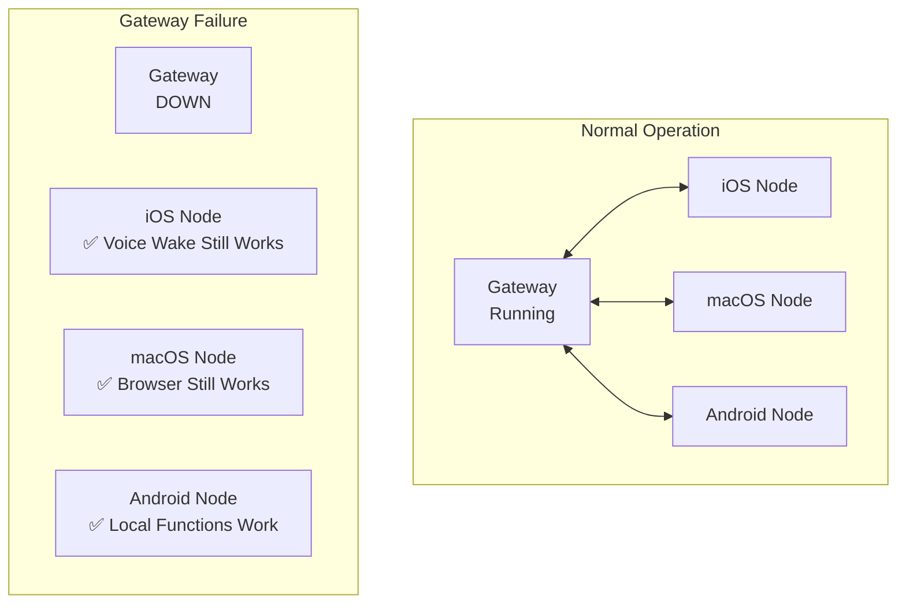

# Production Deployment Guide 🚀

This guide covers deploying OpenClaw securely and reliably in production, including the distributed brain/node architecture for resilience.

<Note>
**Current Status**: OpenClaw is production-ready for **private deployments** (Tailscale, VPN, trusted networks). Public internet exposure requires additional hardening described below.
</Note>

## Architecture: Brain vs Nodes

### The Gateway (Brain)

The **Gateway** is the central coordination point:
- Routes messages between channels and agents
- Maintains session state and conversation history
- Manages OAuth tokens and credentials
- Coordinates connected nodes (iOS, Android, macOS)

**Key Characteristics**:
- Single instance (no clustering yet)
- State stored locally (`~/.openclaw/`)
- CPU/RAM requirements: 1-2 cores, 2-4GB RAM
- Network requirements: Persistent WebSocket connections

### Nodes (Independent Agents)

**Nodes** are remote devices that can operate independently:
- **iOS/Android**: Voice Wake, Canvas, Camera, Location
- **macOS**: Browser automation, System commands, File access
- **Edge devices**: Custom capabilities via node SDK

**Key Characteristics**:
- ✅ **Operate independently** if Gateway goes down
- ✅ **Local-first** - core functionality works offline
- ✅ **Reconnect automatically** when Gateway available
- ⚠️ **No state sync** - changes during disconnect not synced

### Resilience Model



**What works when Gateway is down**:
- ✅ Voice Wake on nodes (local STT)
- ✅ Browser control (macOS node local)
- ✅ Canvas rendering (iOS/Android local)
- ✅ Camera feeds (local processing)
- ❌ Multi-channel messaging (requires Gateway)
- ❌ Session continuity (requires Gateway state)
- ❌ Cross-node coordination (requires Gateway)

## Security Hardening

### 1. Authentication & Authorization

#### Gateway Authentication

**Production Requirements**:

```json5
{
  gateway: {
    auth: {
      mode: "token",  // or "password"
      token: "${OPENCLAW_GATEWAY_TOKEN}",  // 32+ char random token
      allowTailscale: true  // If using Tailscale
    }
  }
}
```

**Generate Strong Token**:
```bash
# Generate 32-char random token
openssl rand -base64 32 | tr -d '\n' > ~/.openclaw/.gateway-token
export OPENCLAW_GATEWAY_TOKEN=$(cat ~/.openclaw/.gateway-token)
```

**Token Requirements**:
- ✅ Minimum 32 characters
- ✅ Cryptographically random
- ✅ Stored in environment variables (not config file)
- ✅ Rotated periodically (90 days recommended)

#### Channel Access Control

**DM Policy** (CRITICAL):

```json5
{
  channels: {
    whatsapp: {
      dmPolicy: "pairing",  // NEVER use "open" in production
      allowFrom: [
        "+15551234567"  // Explicit allowlist
      ]
    },
    telegram: {
      dm: {
        policy: "pairing"
      }
    },
    discord: {
      dm: {
        policy: "pairing",
        allowFrom: ["user:123456789"]
      }
    }
  }
}
```

**Group Chat Policy**:

```json5
{
  channels: {
    whatsapp: {
      groups: {
        "*": {
          requireMention: true,  // Must @mention bot
          groupPolicy: "allowlist"  // Only approved groups
        }
      }
    }
  }
}
```

**Run Security Audit**:

```bash
# Check for security issues
openclaw security audit --deep

# Auto-fix common issues
openclaw security audit --fix
```

### 2. Network Security

#### TLS/HTTPS Configuration

**Self-Signed Cert** (Development):

```bash
openclaw gateway --tls --port 18789
# Auto-generates self-signed cert
```

**Custom Certificate** (Production):

```json5
{
  gateway: {
    tls: {
      enabled: true,
      certPath: "/path/to/cert.pem",
      keyPath: "/path/to/key.pem",
      caPath: "/path/to/ca.pem"  // Optional
    }
  }
}
```

**Let's Encrypt with Caddy** (Recommended):

```caddyfile
openclaw.example.com {
  reverse_proxy localhost:18789 {
    header_up X-Forwarded-For {remote}
    header_up X-Real-IP {remote}
  }
}
```

Update OpenClaw config:

```json5
{
  gateway: {
    bind: "127.0.0.1",  // Only accept from Caddy
    trustedProxies: ["127.0.0.1"],
    auth: {
      mode: "token",
      token: "${OPENCLAW_GATEWAY_TOKEN}"
    }
  }
}
```

#### Firewall Rules

**Recommended Ports**:

| Port | Service | Exposure |
|------|---------|----------|
| 18789 | Gateway | Tailscale/VPN only |
| 443 | HTTPS (via proxy) | Trusted IPs only |

**iptables Example**:

```bash
# Allow Tailscale subnet only
iptables -A INPUT -p tcp --dport 18789 -s 100.64.0.0/10 -j ACCEPT
iptables -A INPUT -p tcp --dport 18789 -j DROP

# Or allow specific IP
iptables -A INPUT -p tcp --dport 18789 -s 203.0.113.1 -j ACCEPT
```

#### Rate Limiting

**Nginx Reverse Proxy**:

```nginx
limit_req_zone $binary_remote_addr zone=openclaw:10m rate=10r/s;

server {
    location / {
        limit_req zone=openclaw burst=20 nodelay;
        proxy_pass http://127.0.0.1:18789;
    }
}
```

<Warning>
**Gap**: OpenClaw does not have built-in rate limiting. Always deploy behind a reverse proxy with rate limiting in production.
</Warning>

### 3. Data Protection

#### File Permissions

**Audit and Fix**:

```bash
# Check permissions
openclaw security audit --fix

# Manual hardening
chmod 700 ~/.openclaw
chmod 600 ~/.openclaw/openclaw.json
chmod 600 ~/.openclaw/credentials/**/*.json
chmod 600 ~/.openclaw/agents/*/auth-profiles.json
```

**systemd Protection** (Linux):

```ini
[Service]
# Restrict filesystem access
ProtectSystem=strict
ProtectHome=true
PrivateTmp=true
ReadWritePaths=/home/openclaw/.openclaw

# Prevent privilege escalation
NoNewPrivileges=true
PrivateDevices=true

# Network security
RestrictAddressFamilies=AF_INET AF_INET6 AF_UNIX
```

#### Encryption at Rest

<Warning>
**Current Limitation**: OpenClaw does not encrypt credentials on disk. Relies on OS file permissions and filesystem encryption.
</Warning>

**Recommendations**:

1. **Full Disk Encryption** (Best):
   - Linux: LUKS
   - macOS: FileVault
   - Windows: BitLocker

2. **Encrypted Home Directory**:
   ```bash
   # Linux with ecryptfs
   sudo apt install ecryptfs-utils
   ecryptfs-migrate-home -u openclaw
   ```

3. **Secrets Management** (Enterprise):
   - AWS Secrets Manager
   - HashiCorp Vault
   - Azure Key Vault

**Environment Variable Storage**:

```bash
# Store sensitive values in environment
export OPENCLAW_GATEWAY_TOKEN="..."
export DISCORD_BOT_TOKEN="..."
export TELEGRAM_BOT_TOKEN="..."

# Reference in config
{
  "gateway": {
    "auth": {
      "token": "${OPENCLAW_GATEWAY_TOKEN}"
    }
  }
}
```

#### Session Data Protection

**Sensitive Data in Sessions**:
- Session transcripts: `~/.openclaw/agents/<agentId>/sessions/*.jsonl`
- Contains: Full conversation history, tool calls, API responses
- Encryption: None (relies on file permissions)

**Recommendations**:
- Restrict access: `chmod 700 ~/.openclaw/agents`
- Periodic cleanup: Delete old sessions
- Backup strategy: Encrypted backups only

### 4. Node Security

#### Node Registration

**Pairing Process**:

1. Node connects with device ID
2. User approves pairing (generates pairing code)
3. Token exchanged for authenticated connection

**Security Model**:
- Nodes authenticate to Gateway (not vice versa)
- Node capabilities declared on connect
- Gateway validates node permissions per command

#### Remote Execution (system.run)

<Warning>
**High Risk**: `system.run` on macOS nodes is remote shell access. Secure carefully.
</Warning>

**macOS Node Protection**:

1. **Security Level** (in macOS app settings):
   - `deny`: Block all remote execution
   - `ask`: Prompt for each command
   - `security`: Only approved commands
   - `allowlist`: Specific commands only

2. **Recommended for Production**:
   ```json5
   // On macOS node
   {
     "exec": {
       "security": "allowlist",
       "allowedCommands": [
         "open -a Safari",
         "osascript -e 'tell app...'"
       ]
     }
   }
   ```

#### Browser Control

**CDP (Chrome DevTools Protocol) Exposure**:

- Gateway can control browser on remote macOS node
- Requires node pairing + CDP port forwarding
- Security: Authenticated WebSocket, not exposed publicly

**Recommendations**:
- Only pair trusted nodes
- Use Tailscale for node connectivity
- Audit browser commands (navigation, script execution)

## Scalability

### Current Limitations

| Component | Single Instance | Clustered | Notes |
|-----------|----------------|-----------|-------|
| **Gateway** | ✅ | ❌ | No multi-gateway clustering |
| **Nodes** | ∞ | ✅ | Unlimited nodes per gateway |
| **Sessions** | Local disk | ❌ | No shared session store |
| **Credentials** | Local disk | ❌ | No shared credential vault |

### Vertical Scaling

**Gateway Resource Requirements**:

| Load | CPU | RAM | Disk I/O | Network |
|------|-----|-----|----------|---------|
| Light (1-10 sessions/day) | 0.5 core | 1GB | Low | Low |
| Medium (10-100 sessions/day) | 1-2 cores | 2-4GB | Medium | Medium |
| Heavy (100+ sessions/day) | 2-4 cores | 4-8GB | High | High |

**Optimization Tips**:

1. **Session Pruning**:
   ```json5
   {
     agents: {
       defaults: {
         sessionPruning: {
           enabled: true,
           maxAge: "30d",
           maxCount: 100
         }
       }
     }
   }
   ```

2. **Compaction**:
   ```json5
   {
     agents: {
       defaults: {
         compaction: {
           enabled: true,
           triggerTokens: 100000
         }
       }
     }
   }
   ```

3. **Model Provider Caching**:
   - Use local models (Ollama) for common tasks
   - Reserve cloud models for complex reasoning
   - Configure fallback chains

### Horizontal Scaling (Future)

**Not Currently Supported**:
- Multi-gateway clusters
- Shared session store (Redis, PostgreSQL)
- Load balancing across gateways
- Split-brain resolution

**Workaround**: Run multiple isolated gateways for different:
- Users (one gateway per user)
- Channels (separate gateway for WhatsApp, Telegram, etc.)
- Agents (separate gateway per agent personality)

## Monitoring & Observability

### Health Checks

**HTTP Endpoint**:

```bash
# Check gateway health
curl http://localhost:18789/health
```

**Response**:
```json
{
  "status": "ok",
  "version": "2026.2.12",
  "uptime": 86400,
  "channels": {
    "whatsapp": "connected",
    "telegram": "connected"
  },
  "nodes": {
    "connected": 2
  }
}
```

**Monitoring Script**:

```bash
#!/bin/bash
# healthcheck.sh
RESPONSE=$(curl -s -o /dev/null -w "%{http_code}" http://localhost:18789/health)
if [ "$RESPONSE" != "200" ]; then
    echo "Gateway down! HTTP $RESPONSE"
    # Alert (email, PagerDuty, etc.)
    exit 1
fi
```

### Logging

**Configure Logging Levels**:

```json5
{
  logging: {
    level: "info",  // error | warn | info | debug
    redactSensitive: "tools",  // Redact tool outputs
    subsystems: {
      "gateway": "debug",
      "channels": "info"
    }
  }
}
```

**Log Locations**:

| Component | Location | Format |
|-----------|----------|--------|
| Gateway | `~/.openclaw/logs/gateway.log` | NDJSON |
| Commands | `~/.openclaw/logs/commands.log` | NDJSON (if hook enabled) |
| Sessions | `~/.openclaw/agents/*/sessions/*.jsonl` | JSONL |

**Log Aggregation** (Recommended):

```bash
# Ship to Loki
promtail -config.file=promtail.yaml

# Ship to Elasticsearch
filebeat -c filebeat.yml

# Ship to CloudWatch
aws logs put-log-events ...
```

### Metrics (Not Built-in)

<Warning>
**Gap**: OpenClaw does not expose Prometheus metrics. Requires custom instrumentation.
</Warning>

**Workaround - Parse Logs**:

```python
# metrics_exporter.py
import json
import time
from prometheus_client import Counter, Gauge, start_http_server

sessions_total = Counter('openclaw_sessions_total', 'Total sessions')
sessions_active = Gauge('openclaw_sessions_active', 'Active sessions')

with open('~/.openclaw/logs/gateway.log') as f:
    for line in f:
        event = json.loads(line)
        if event.get('type') == 'session_start':
            sessions_total.inc()
            sessions_active.inc()
        elif event.get('type') == 'session_end':
            sessions_active.dec()

start_http_server(9090)
time.sleep(float('inf'))
```

### Alerting

**Critical Alerts**:

| Condition | Action | Priority |
|-----------|--------|----------|
| Gateway down >5min | Page on-call | P0 |
| Node disconnected >15min | Alert | P1 |
| OAuth token expired | Alert | P1 |
| Disk space <10% | Alert | P2 |
| Memory >90% | Alert | P2 |

**Alert Channels**:
- PagerDuty
- Slack webhooks
- Email (SMTP)
- ntfy (self-hosted)

## Disaster Recovery

### Backup Strategy

**Critical Data**:

```bash
# What to backup
~/.openclaw/openclaw.json          # Configuration
~/.openclaw/credentials/           # OAuth tokens, channel creds
~/.openclaw/agents/*/auth-profiles.json  # Model auth
~/.openclaw/agents/*/sessions/     # Session history (optional)
~/.openclaw/agents/*/memory/       # Agent memory (optional)
```

**Backup Script**:

```bash
#!/bin/bash
# backup.sh
BACKUP_DIR="/backup/openclaw"
DATE=$(date +%Y%m%d-%H%M%S)

# Create encrypted backup
tar czf - ~/.openclaw | \
    gpg --encrypt --recipient you@example.com \
    > "$BACKUP_DIR/openclaw-$DATE.tar.gz.gpg"

# Rotate old backups (keep 30 days)
find "$BACKUP_DIR" -name "openclaw-*.tar.gz.gpg" -mtime +30 -delete
```

**Automated Backups**:

```bash
# Cron (daily at 2 AM)
0 2 * * * /usr/local/bin/backup-openclaw.sh
```

### Recovery Procedure

**1. Fresh Install**:

```bash
npm install -g openclaw@latest
```

**2. Restore Configuration**:

```bash
# Extract backup
gpg --decrypt openclaw-20260212.tar.gz.gpg | tar xzf -

# Restore to home directory
cp -r openclaw-backup/.openclaw ~/
chmod 700 ~/.openclaw
chmod 600 ~/.openclaw/openclaw.json
```

**3. Validate**:

```bash
openclaw doctor
openclaw security audit
```

**4. Restart Gateway**:

```bash
openclaw gateway --port 18789
```

**5. Reconnect Nodes**:
- iOS/Android: May need to re-pair if device IDs changed
- macOS: Should reconnect automatically if same device

### High Availability (Advanced)

**Current State**: Single Gateway, No HA

**Future Architecture** (Requires Development):

```
┌─────────────────────────────────────────┐
│         Load Balancer (HAProxy)         │
└──────────┬────────────────┬─────────────┘
           │                │
    ┌──────▼─────┐   ┌─────▼──────┐
    │ Gateway 1  │   │ Gateway 2  │
    └──────┬─────┘   └─────┬──────┘
           │                │
    ┌──────▼────────────────▼──────┐
    │   Shared Session Store        │
    │   (PostgreSQL/Redis)          │
    └───────────────────────────────┘
```

**Required Changes**:
- Shared session storage (PostgreSQL + JSONB)
- Distributed credentials (HashiCorp Vault)
- Leader election (etcd, Consul)
- WebSocket sticky sessions

**Workaround (Now)**: Run backup Gateway with failover DNS/IP.

## Production Checklist

### Pre-Deployment

- [ ] Generate strong gateway token (32+ chars)
- [ ] Enable TLS with valid certificate
- [ ] Configure channel allowlists (no `dmPolicy="open"`)
- [ ] Set `groupPolicy="allowlist"` for all channels
- [ ] Enable `requireMention` for group chats
- [ ] Run `openclaw security audit --fix`
- [ ] Test node pairing and failover
- [ ] Configure firewall rules (Tailscale/VPN only)
- [ ] Set up reverse proxy with rate limiting
- [ ] Enable full disk encryption
- [ ] Configure automated backups
- [ ] Set up health check monitoring
- [ ] Create runbook for common issues

### Post-Deployment

- [ ] Verify health checks responding
- [ ] Test message delivery (all channels)
- [ ] Verify node connectivity
- [ ] Test Gateway failure scenario
- [ ] Monitor logs for errors
- [ ] Set up alerts (Gateway down, node disconnect)
- [ ] Document recovery procedures
- [ ] Schedule regular security audits
- [ ] Plan token rotation schedule

### Ongoing Maintenance

- [ ] Weekly: Review logs for anomalies
- [ ] Monthly: Run security audit
- [ ] Quarterly: Rotate gateway tokens
- [ ] Quarterly: Update Node.js (security patches)
- [ ] Quarterly: Review and update allowlists
- [ ] Annually: Disaster recovery drill

## Troubleshooting

### Gateway Won't Start

**Check logs**:
```bash
tail -f ~/.openclaw/logs/gateway.log
```

**Common issues**:
- Port already in use: `lsof -i :18789`
- Invalid config: `openclaw doctor`
- Missing credentials: Check `~/.openclaw/credentials/`

### Nodes Not Connecting

**1. Check node status**:
```bash
# On node device
openclaw nodes list
```

**2. Verify network connectivity**:
```bash
# Can node reach gateway?
curl https://gateway.example.com:18789/health
```

**3. Check pairing status**:
```bash
# On gateway
openclaw pairing list
```

**4. Re-pair if needed**:
```bash
# On gateway
openclaw pairing approve node <code>
```

### Node Works But Gateway Down

**This is expected behavior!** Nodes are designed to work independently.

**What still works**:
- Voice Wake (local STT)
- Browser control (macOS)
- Canvas rendering
- Local file access

**What doesn't work**:
- Multi-channel messaging
- Session continuity
- Cross-node commands

**Recovery**: Restart Gateway, nodes reconnect automatically.

## Security Contact

For security issues, see [SECURITY.md](/SECURITY.md) or email **security@openclaw.ai**.

## Learn More

<Columns>
  <Card title="Security" href="/gateway/security" icon="shield">
    Threat model and hardening guide
  </Card>
  <Card title="Gateway Configuration" href="/gateway/configuration" icon="settings">
    All gateway configuration options
  </Card>
  <Card title="Nodes" href="/nodes" icon="smartphone">
    iOS, Android, macOS node setup
  </Card>
  <Card title="Docker" href="/install/docker" icon="container">
    Containerized deployment
  </Card>
  <Card title="Monitoring" href="/gateway/troubleshooting" icon="activity">
    Diagnostics and troubleshooting
  </Card>
  <Card title="Backup & Recovery" href="/gateway/doctor" icon="database">
    Doctor tool and state management
  </Card>
</Columns>

---

**Next**: [Security Audit Tool](/cli/security) — Deep dive into security checks
